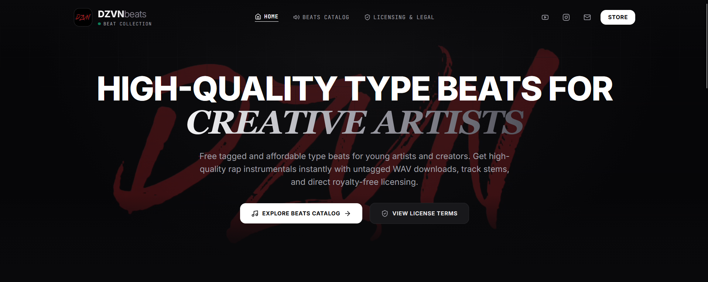

# DZVNbeats Portfolio

[](https://denzven.github.io/DZVNbeats/)

A personal portfolio and beat store website built with React, Vite, and Tailwind CSS.

## Available Beats

- **Akbaar** (100 BPM, G major) - Genre: Hip hop
- **Flute Case** (131 BPM, F#minor)

## Features

- **React 18** for building the user interface.
- **Vite** for fast, optimized development and production builds.
- **Tailwind CSS** for rapid and responsive styling.
- **Framer Motion** for smooth animations and transitions.
- **Zustand** for lightweight state management.
- **Lucide React** for beautiful icons.

## Prerequisites

- Node.js (v18 or higher recommended)
- npm

## Getting Started

1. **Install dependencies:**

   ```bash
   npm install
   ```

2. **Run the development server:**

   ```bash
   npm run dev
   ```

   This will start the application locally, accessible in your browser. 

3. **Build for production:**

   ```bash
   npm run build
   ```

   The built files will be output to the `dist` directory.

4. **Preview the production build:**

   ```bash
   npm run preview
   ```

## Scripts

- `npm run dev`: Starts the Vite development server.
- `npm run build`: Compiles TypeScript and builds the app for production.
- `npm run preview`: Previews the production build locally.
- `npm run lint`: Runs ESLint to check for code issues.

## License

This project is proprietary and confidential unless stated otherwise.
