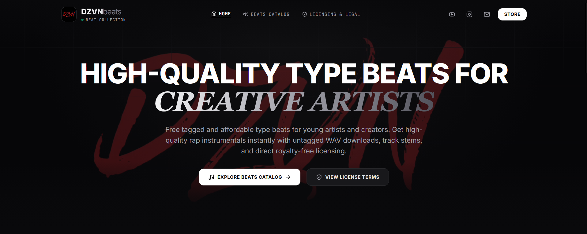

# DZVNbeats Portfolio

[](https://denzven.github.io/DZVNbeats/)

A personal portfolio and beat store website built with React, Vite, and Tailwind CSS.

## Available Beats

- **Akbaar** (100 BPM, G major) - Genre: Hip hop
- **Flute Case** (131 BPM, F#minor)

## Features

- **React 18** for building the user interface.
- **Vite** for fast, optimized development and production builds.
- **Tailwind CSS** for rapid and responsive styling.
- **Framer Motion** for smooth animations and transitions.
- **Zustand** for lightweight state management.
- **Lucide React** for beautiful icons.

## Prerequisites

- Node.js (v18 or higher recommended)
- npm

## Getting Started

1. **Install dependencies:**

   ```bash
   npm install
   ```

2. **Run the development server:**

   ```bash
   npm run dev
   ```

   This will start the application locally, accessible in your browser.

3. **Build for production:**

   ```bash
   npm run build
   ```

   The built files will be output to the `dist` directory.

4. **Preview the production build:**

   ```bash
   npm run preview
   ```

## 🎵 Uploading & Managing Beats

### Method 1: Interactive Upload Wizard (Recommended)

Run the upload assistant from your terminal:

```bash
npm run upload
# or
npm run add-beat
```

The wizard will:
1. Allow you to drag & drop your audio file or pick from uncataloged files.
2. Auto-detect audio duration, bitrate, ID3 tags (title, artist, BPM, musical key, genre, and embedded artwork).
3. Prompt for licensing tier (Standard ₹200, Exclusive ₹1,000, or Free ₹0).
4. Auto-extract cover artwork or generate a branded cover if none is attached.
5. Standardize the filename according to DZVN studio conventions:
   `DZVN_[Title]_[BPM]BPM_[Key]_[Status]_[Tier]_[Tagged/Untagged].[ext]`
6. Instantly update the catalog manifest, generate static SEO landing pages, and run an automated audit verification.

#### Non-Interactive CLI Upload
You can also supply command line flags directly:

```bash
npm run upload -- "path/to/Beat.wav"
# or with flags:
node scripts/upload-beat.js --file="C:\Beats\Fire_Beat.wav" --bpm=140 --key="C minor" --tier="std" --tag="untagged"
```

---

### Method 2: Direct Drop-in Upload

You can simply drop your audio file directly into `public/beats/`:
- If named using DZVN format (`DZVN_Title_140BPM_Cmin_ava_std_Untagged.wav`), it will automatically parse the exact license, key, and tempo.
- If you have an un-embedded cover image, drop `Title.jpg` next to the audio or in `public/covers/`.
- Run `npm run generate-manifest` or start the dev server (`npm run dev`). The live watcher will automatically process the audio.

---

### 🔍 Catalog Verification & Audit

Audit your entire catalog integrity at any time:

```bash
npm run verify
```

Checks:
- Audio file accessibility and non-zero byte size.
- BPM, Key signatures, durations, and pricing metadata.
- Cover artwork presence in `public/covers/`.
- Static SEO landing pages in `public/beat/[id]/index.html`.
- Legal contract PDFs integrity.
- Detection of orphaned/stale audio files or unused cover images.

---

## ⚡ Streamlined & Cached Build Pipeline

The build process is fully optimized with smart zero-waste caching:
- **Contracts (`scripts/generate-contracts.js`)**: Skips PDF regeneration when contract agreements already exist and have not changed. Use `npm run generate-contracts -- --force` to rebuild.
- **Manifest (`generate-manifest.js`)**: Uses metadata disk caching (`.beats-manifest-cache.json`) so 30-50MB WAV files are not re-read or parsed over and over during development.
- **SEO Pages (`scripts/generate-beat-pages.js`)**: Idempotent file writes prevent redundant disk I/O and Vite reload churn.
- **Optimized Bundling (`vite.config.ts`)**: Code split with Rollup `manualChunks` into clean vendor bundles for React, Framer Motion, and PDF generation.

---

---

## 🎬 YouTube Video Generation & Automated Upload

Automate turning your beats into full 1080p YouTube videos and publishing them with maximum-reach metadata.

### 1. Render Video with Cover Art & Audio

Uses local FFmpeg to generate 1080p 16:9 Longform or 9:16 Shorts with blurred background:

```bash
# Render video for the newest beat (or specify slug like: npm run create-video champagne)
npm run create-video

# Render vertical 9:16 video for YouTube Shorts / TikTok / Reels:
npm run create-video -- --shorts

# Render all catalog beats:
npm run create-video -- --all
```

Rendered videos are saved to `dist/videos/` with 320kbps pristine AAC audio.

---

### 2. Preview Algorithm Reach Metadata

Generate high-ranking YouTube titles, structured SEO descriptions, and 500-char tag clusters:

```bash
npm run youtube-meta
# or specify beat and artist style:
node scripts/youtube-metadata.js champagne --artist="Jersey Club"
```

Features included:
- **High-CTR Title**: `[FREE] {Artist/Style} Type Beat 2026 - "{Title}" | {BPM} BPM ({Key})`
- **Above-the-Fold Conversion**: Immediate links to direct beat purchase & free download
- **Pricing Breakdown**: Free Tagged, Basic Lease ₹200, Exclusive ₹1,000
- **Auto Chapters / Timestamps**: Intro, Hook, Verse 1, Hook 2, Outro
- **Legal Content ID Notice**: Informs artists about licensing and copyright rules

---

### 3. Automated 1-Click YouTube Upload

Upload your video, title, description, tags, and custom cover art thumbnail directly to YouTube:

```bash
npm run upload-youtube
# or with options:
node scripts/upload-youtube.js champagne --privacy=public
```

#### One-Time Free Setup (Google Cloud Console):
1. Go to [Google Cloud Console](https://console.cloud.google.com/) and create a free project.
2. Enable the **YouTube Data API v3** (10,000 free daily units = ~6 video uploads/day for free).
3. Under **Credentials**, create an **OAuth 2.0 Client ID** (Desktop Application).
4. Download the JSON file and save it as `client_secrets.json` in the project root.
5. Run `npm run upload-youtube` to authenticate once; your token is saved locally to `.youtube-token.json`.

---

## 🌐 Multi-Platform Free Automation Ecosystem

| Platform | Free Automation Capability | Method |
| :--- | :--- | :--- |
| **YouTube (Longform)** | 100% Automated (Video render + Upload + SEO + Thumbnail) | `npm run upload-youtube` (YouTube Data API v3) |
| **YouTube Shorts / Reels** | 1080x1920 9:16 Video Render | `npm run create-video -- --shorts` (FFmpeg) |
| **Discord Communities** | Instant Rich Embed Announcement with cover & link | Discord Webhooks (`scripts/post-discord.js`) |
| **Telegram Channel** | Direct MP3 upload with cover art & license button | Telegram Bot API (`sendAudio`) |
| **Reddit (r/TypeBeats)** | Automated post submission with video link | Reddit API (`snoowrap` / PRAW) |
| **Audiomack** | Unlimited free beat uploads (no storage limits) | Audiomack Creator API / Automation |
| **SoundCloud** | Free 3 hours audio upload | CLI / Browser Automation |

---

## Scripts

- `npm run upload`: Interactive CLI assistant to upload, sanitize, and catalog new songs.
- `npm run verify`: Audits catalog health, audio files, covers, and contracts.
- `npm run create-video`: Renders 1080p YouTube videos from beat audio and cover art.
- `npm run youtube-meta`: Generates algorithm-optimized titles, descriptions, and tags.
- `npm run upload-youtube`: 1-click YouTube video upload with custom thumbnail and SEO.
- `npm run dev`: Starts the Vite development server with debounced auto-cataloging.
- `npm run build`: Typechecks and builds the production bundle with intelligent asset caching.
- `npm run preview`: Previews the production build locally.
- `npm run lint`: Runs ESLint to check for code issues.

## License

This project is proprietary and confidential unless stated otherwise.
